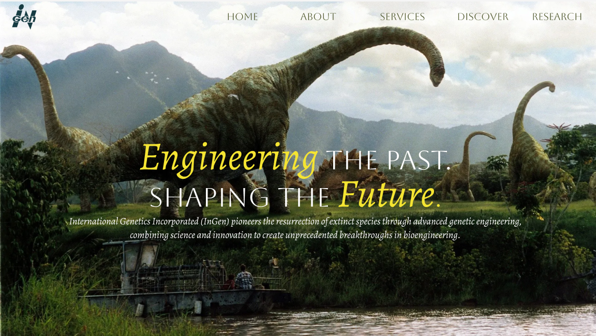

[Try it out!](https://ingen-93cf.vercel.app/)
# InGen: Jurassic World Inspired Website

This project is inspired by the fictional company **InGen** (shown in the _Jurassic World_ series).  
The website is designed as if InGen had a modern-day online presence, serving as a **practice project** to strengthen skills in **UI/UX design, responsiveness, and animations**.

## 🎯 Project Goals

- Practice building **modern UI/UX layouts**
- Explore **animations and motion design** using Framer Motion
- Create a **fully responsive** website across devices
- Work with a **TypeScript + Next.js + TailwindCSS** stack

## 🏗️ Website Sections

- **Hero Section** – Bold cinematic entry
- **About** – Fictional company introduction
- **Services** – What InGen offers in this imagined version
- **Recent Stats** – Fictional data visualization
- **Team** – Meet the creators behind InGen
- **Words from the Team** - Words, sayings, or quotes from team members  

## 🚀 Tech Stack

- **Next.js** – Framework for optimized React development
- **TypeScript** – Strongly typed JavaScript
- **TailwindCSS** – Utility-first CSS framework
-- **Framer Motion** – Smooth animations and interactive transitions  

## ✨ Skills Explored

- 🎨 UI/UX design principles
- 📱 Responsive web design
- 🎥 Animation workflows with GSAP
- ⚡ Performance optimization with Next.js

## 🛠️ Getting Started

Follow these steps to run the project locally:

1. **Clone the repository**

```bash
git clone https://github.com/JanhviSharma1/ingen.git
cd ingen
```

2. **Install dependencies**
```bash
npm install
# or
yarn install
```

3. **Run the development server**
```bash
npm run dev
# or
yarn dev
```

Open your browser and visit http://localhost:3000
